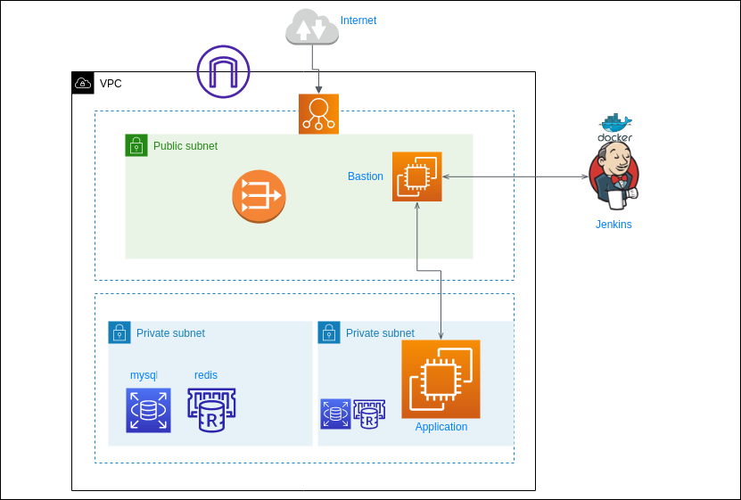
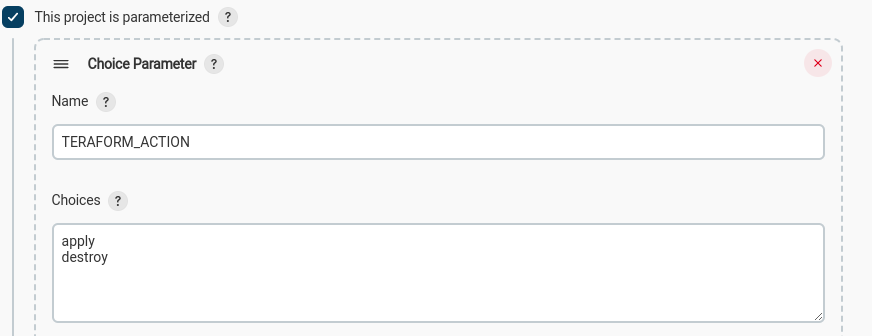
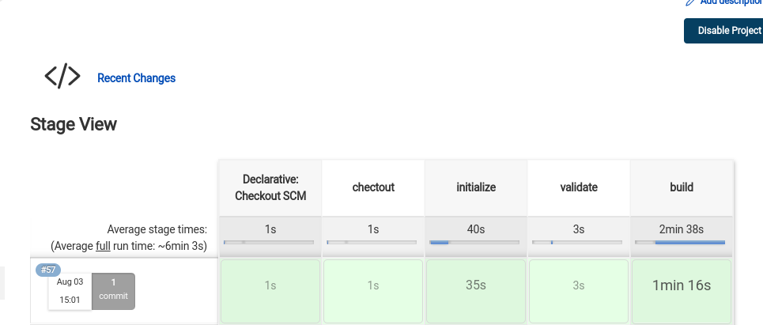
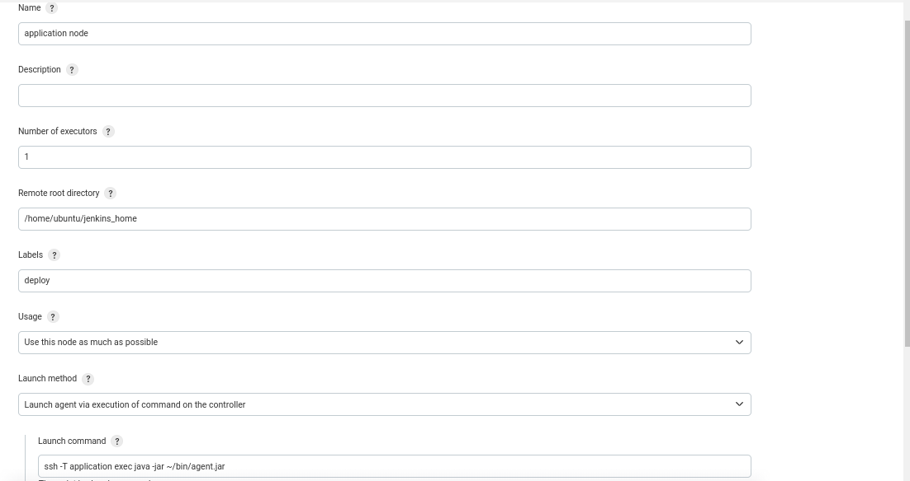
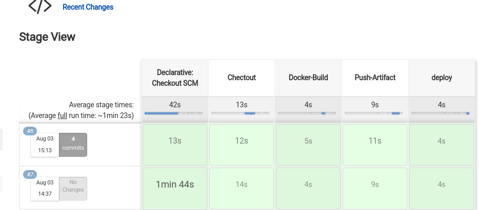
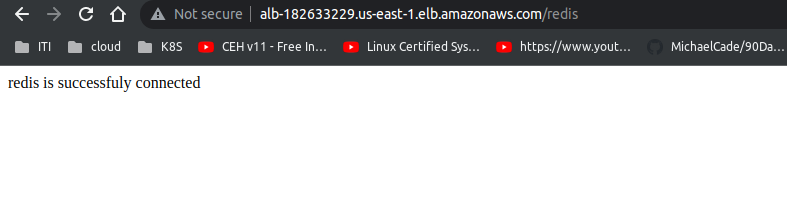
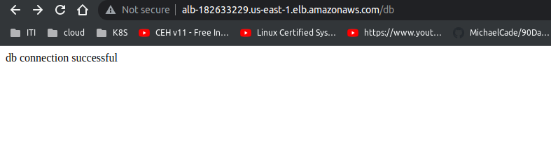
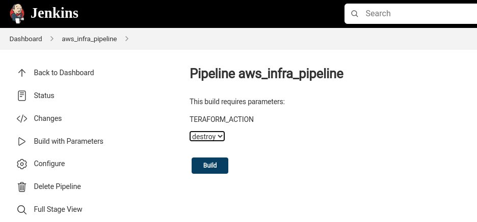

Provision AWS infrastructure using terraform and jenkins 
====

Description
----

Using Jenkins pipeline to provision infrastructure. using Ansible to configure the bastion host and the application server as slave for jenkins to run on it a Node.js app that connects to RDS and ElastiCache Redis instances in private subnets


### Deploying Jenkins Master

Run jenkins master as container on local machine

```bash
# build the custom image that contains ansible and docker client 
cd jenkins
docker build -t <imageName> -f jenkins_master.dockerfile .

# run the image
docker run --name <containerName> -p8080:8080 -d -v /var/run/docker.sock:/var/run/docker.sock  -v /usr/bin/terraform:/usr/bin/terraform <imageName>

```

Hit the jenkins master at http://localhost:8080/


Then, go to the Jenkins page and configure it as follows:

Infrastructure Pipeline
===

- Add AWS credentials to Jenkins
 
- Create a parameterized pipeline



Build the infrastructure choose **apply** 


Configure EC2 as Jenkins Slave
----
Goto "Manage Nodes and Clouds" => "New Node"




Application Pipeline
====
Create a new pipeline for the application [link](https://github.com/mohamedanwer006/jenkins_nodejs_example/tree/rds_redis)  


### Test application 
open browser and type the ALB url






Clean up
----
Build the pipeline a gain and choose **destroy**


