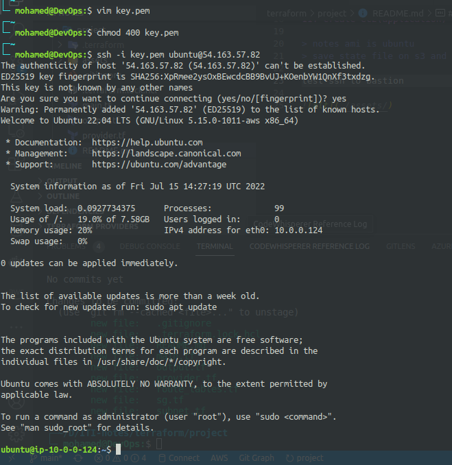
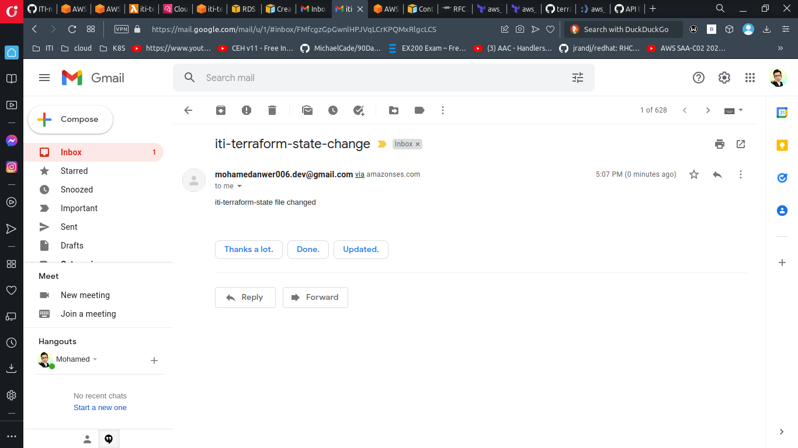

# Project

### Networking
1. create vpc
2. create internet gateway
3. create public route table
4. create private route table
5. create public route
6. attach public route table to subnets


### Compute

7. create security group which allow ssh from 0.0.0.0/0
8. create security group that allow ssh and port 3000 from vpc cidr only
9. create ssh key for bastion and application ec2 save it in aws secret manager 
10.  create ec2(bastion) in public subnet with security group from 7
11. create ec2(application) private subnet with security group from 8

> notes ami is ubuntu
> save state file on s3 and lock on dynamodb

test ssh to bastion



# 2nd

1. create two workspaces dev and prod 
2. create two variable definition files(.tfvars) for the two environments 
3. separate network resources into network module   
4. apply your code to create two environments one in us-east-1 and eu-central-1 
5. run local-exec provisioner to print the public_ip of bastion ec2 
6. upload infrastructure code on github project

7. create rds on private subnet 
8. create elastic cache on private subnet 

9. verify your email in ses service
10.  create lambda function to send email
11. create trigger to detect changes in state file and send the email


### test email 




Create infrastructure pipeline to run terraform with jenkins

```
$ docker run --name jdocker -p8080:8080 -d -v /var/run/docker.sock:/var/run/docker.sock  -v /usr/bin/terraform:/usr/bin/terraform jdocker

```

task

Create ansible script to configure application ec2(private)

8. configure ansible to run over private ips through bastion (~/.ssh/config)

/home/mohamed/Downloads/jenkins-key.pem

9. write ansible script to configure ec2 to run  as jenkins slaves

9. configure slave in jenkins dashboard (with private ip)
inside jenkins container

/root/.ssh/config
```
echo "
Host bastion
        HostName 3.94.98.16
        IdentityFile /var/jenkins_home/.ssh/id_rsa
        User ubuntu

Host application
        HostName 10.0.1.152     
        IdentityFile /var/jenkins_home/.ssh/id_rsa
        Port 22
        User ubuntu     
        ProxyCommand ssh -q -W %h:%p bastion
" > config

```

10. create pipeline to deploy nodejs_example fro branch (rds_redis)


11. add application load balancer to your terraform code to expose your nodejs app on port 80 on the load balancer


12. test your application by calling loadbalancer_url/db and /redis


13. create documentation illustrating your steps with screenshots
